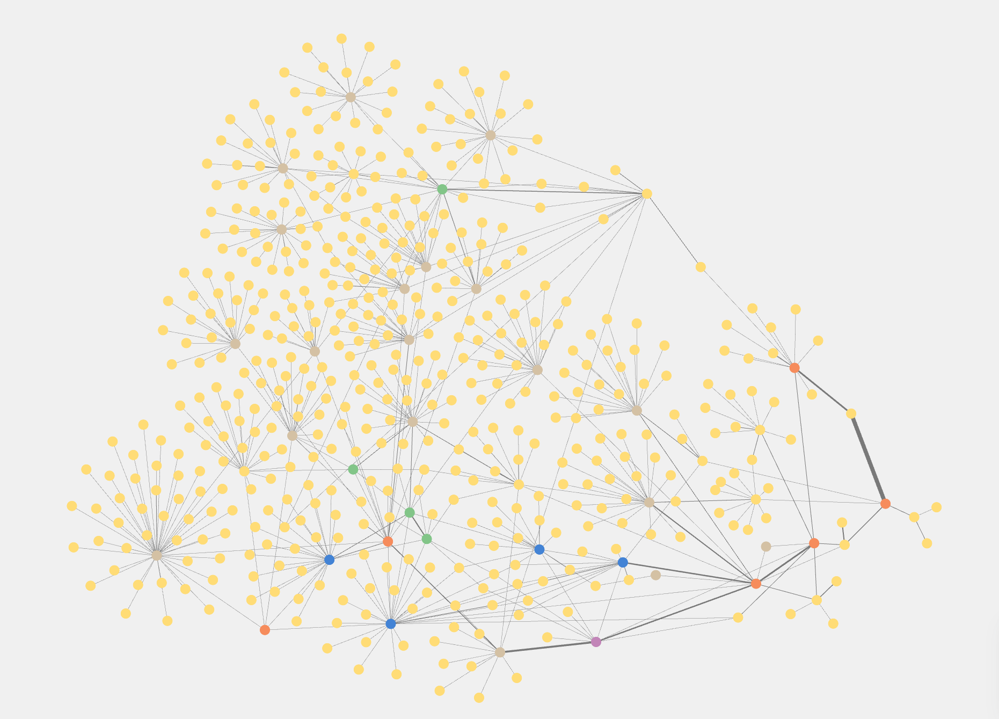
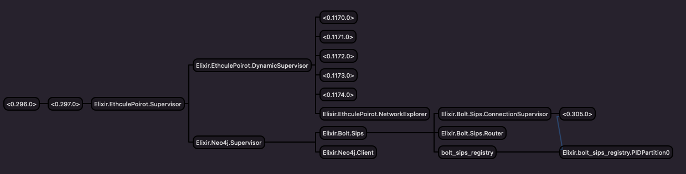

# Ethcule Poirot


Application to explore Ethereum transactions using the Blocksout API and a Neo4J database to store nodes (accounts/smart contracts) and respective relationships, through a transaction.

The goal of this project is to start by exploring a specific Address, and then redo the same process for other Addresses of interest, and that correlate in some way with an existing one. This way, we're able to grow our Network in the direction we want to.

Example of an Address network. Note that by default Smart Contracts and Initial Addresses (were you start exploring are marked in a different color).



### Neo4J Database

To store information we're using [Neo4J](https://neo4j.com/). It's a graph data platform, and that's exactly the structure we want to represent a network of Ethereum Addresses.

Neo4J can be installed locally, but in this case, for an easier kickstart of the project we're using a fully managed cloud service called [Neo4J AuraDB](https://neo4j.com/cloud/platform/aura-graph-database/?ref=get-started-dropdown-cta). They offer a free version with a limit of 50k nodes and 175k relationships and that's what we're using for now.

By using Neo4J we're also able to use their built in services like [Bloom](https://neo4j.com/product/bloom/) that gives access to explore and search our Graph in a very interactive way.

## Project Structure
Looking at the image below, there's a clear structure for the supervision tree of this project. On one side we have Processes related to the Database interaction, and on the other we have processes that take care of the exploration of each address.

- `Neo4j.Client`: is a GenServer that holds the `conn` in the state and exposes the respective API to exexute queries in the DB.
- `EthculePoirot.NetworkExplorer`: is a GenServer that holds the Set of visited nodes, the ones that are being explored by `EthculePoirot.AddressExplorer` and other info required to manage the exploration step.



## Setup, lint, and tests

To setup just run

```
bin/setup
``` 

After, you need to update the `.envrc` with the correct variables.

There are the following scripts available, also:

```
bin/lint
bin/test
```

## How to Run

To kickstart the app just run 

```
bin/server
``` 

This will start the application and the respective Supervisors for the Explorers and Neo4j interactions.

After the app starts, to start exploring just pass in an address, and an exploration depth to ` EthculePoirot.NetworkExplorer.explore/2`. It's advised to use a depth of 2, or 3 at most, due to API requests failing for higher values. (Take into account that the number of requests made increases exponentially with `depth`.)

```elixir
address = "0xSomeAddress"
depth = 2
EthculePoirot.NetworkExplorer.explore(address, depth)
```

Each step will be printed, and the exploration for the given address is completed when the following line appears `Fully explored 0xSomeAddress`.

After this, you can check the Neo4j database and play around with it (using `Neo4j Bloom`, for example). Assuming you want to explore more addresses of interest, you just redo the process above with a new address `address = 0xSomeAddress2`, and a new cluster will be created or appended to the existing one. This way, it's possible to follow through and explore the path you wish to.

If you have some addresses you want to "highlight" (or mark with a `Interest` Label in Neo4j) you can run:

```elixir
addresses_list = ["0xAddress1", "0xAddress2"]
Neo4jClient.highlight_accounts_of_interest(addresses_list)
```

It's also possible to clear the database to delete all nodes and relationships, to start explorating from scratch.

```elixir
Neo4j.Client.clear_database
```

## API Adapters

### Existing
 - [Blockscout](https://blockscout.com/eth/mainnet/graphiql): It's free to use and it already gives us transactions and addresses already organized with a lot of information that we need to build our own network. 
   The downside of using it is rate limits from Cloudflare, and a low complexity GraphQL query, that only enables us to query 22 transactions at a time (with the current information we are requesting).

 
### How to implement new ones

Just create a new file under `lib/adapters/api` and implement the respective behaviour.

```
defmodule Adapters.Api.NewApi do
  @moduledoc false

  @behaviour Behaviours.Api

  # implementation here
end
```

## Future Development Ideas

- [ ] Add Tests using [Mox](https://hexdocs.pm/mox/Mox.html) to interact with the Blockscout API and Neo4j.
- [X] Create an Adapter for the `AddressExplorer` to work with different APIs and/or an Ethereum Node.
- [ ] Create an Adapter for `Neo4J.Client`. This way the project can become agnostic on the underlying database provided that the new adapter specifies the Graph structure to be used. With it, we could explore SmartContracts in particular, and just use the project as tooling.
- [ ] Request more transactions per wallet, using the GraphQL cursors provided by Blockscout API.
- [ ] Create a scheduler to pick from the `remaining` pool of addresses and set a concurrency number. [Poolboy](https://elixirschool.com/en/lessons/misc/poolboy) for reference.
- [ ] Differentiate `Pending`, `ERROR`, and `OK` transactions. Maybe different relationships. (For now, a solution is to use "conditional styling" for relationships in `Neo4J Bloom`.)
- [ ] Explore through internal transactions, also.
- [ ] Add support for ENS for highlighting accounts of interest.
